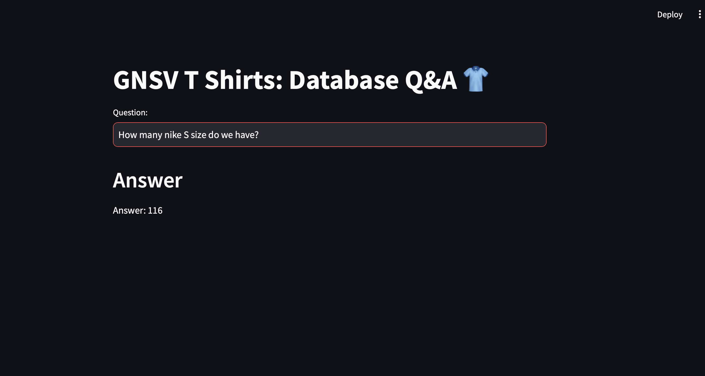

# GNSV T-Shirts: Database Q&A 🧵



## Overview
This project is a **Retail Inventory Q&A Application** that leverages modern AI and database technologies to manage and query product inventory. The application was built using the following key technologies:

- **Google Generative AI** for transforming user queries into SQL queries.
- **FAISS (Facebook AI Similarity Search)** for handling embeddings and improving query response accuracy.
- **Hugging Face** embedding models to create vectorized representations of few-shot examples.
- **Streamlit** for a clean and user-friendly interface for interacting with the inventory system.
- **SQL Database** for storing and retrieving inventory data.

The primary objective of this project is to allow retail business owners or managers to quickly retrieve inventory information by asking natural language questions.

## Features
- **Natural Language Querying**: Users can ask questions in plain English such as "How many Nike S size do we have?" and get instant results.
- **Few-Shot Learning**: Using a few-shot technique, the system improves the understanding of similar queries by referencing stored embeddings.
- **Embedding and Vector Search**: Implemented using Hugging Face and FAISS for vector similarity search to ensure the most accurate results from a vectorized query.
- **SQL Integration**: Converts user input into SQL queries to fetch data from the inventory database.
- **Simple UI**: Developed using Streamlit, the app provides a clean, responsive interface for users.

## Technology Stack
- **Google Generative AI**: Powers the query transformation into SQL syntax.
- **Hugging Face**: Provides embeddings using pre-trained models for enhanced understanding of queries.
- **FAISS**: Stores and searches through embeddings, improving query accuracy.
- **SQL Database**: The main data source for storing inventory details.
- **Streamlit**: Framework for deploying the web-based application.

## Application Flow

1. **User Input**: The user types a question into the Streamlit app. The question could be any natural language request related to inventory, such as:
   - "How many Nike S size do we have?"
   - "What is the stock level for Adidas M size?"

2. **Query Processing**:
    - The input is processed using **Google Generative AI**, which converts the natural language question into an SQL query.

3. **Embedding Search**:
    - The embeddings generated using **Hugging Face's** embedding models are stored in **FAISS**.
    - When a query is received, it's compared with the stored embeddings to find the closest match and improve accuracy.

4. **SQL Execution**:
    - The transformed SQL query is run on the **SQL database** to retrieve the requested inventory data.

5. **Answer Display**:
    - The response is displayed within the **Streamlit** application for the user to view.

## How to Run the Application

### Prerequisites
- Python 3.7 or higher
- Install the required dependencies

### Installation

1. **Clone the Repository**:
    ```bash
    git clone https://github.com/Saivarun2611/Retail_Q-A_tool_google_genAI.git
    
    ```

2. **Install Dependencies**:
     Install the necessary Python libraries:
   

### Run the Application

Once you have installed all the dependencies, you can run the application by executing the following command:

```bash
streamlit run app.py
```

gnsv-tshirt-inventory-qa/
│
├── app.py                     # The main Streamlit application
├── faiss_store.py              # Code for managing FAISS database
├── huggingface_embedder.py     # Embedding generation using Hugging Face
├── sql_database.py             # SQL database connection and query execution
├── requirements.txt            # List of dependencies
├── Final_Application.png       # Preview image of the app
└── README.md                   # This README file

### How It Works
1. Google Generative AI for Query Understanding
The app uses Google Generative AI to convert natural language input into SQL queries. For instance, if a user types "How many Nike S size do we have?", the AI generates a query to retrieve that information from the SQL database.

2. Embedding with Hugging Face
Few-shot learning improves the application's performance by training it on similar queries. Embeddings are created using Hugging Face's transformer models and stored in the FAISS database for similarity matching.

3. Vector Search using FAISS
The FAISS library is used to search and retrieve the most relevant embeddings for the user's query, which are matched against the embeddings of known examples. This helps the application return more accurate results.

4. Data Retrieval via SQL
Once the query is generated and processed, it's executed on an SQL database that holds all the inventory data. The retrieved result is then displayed on the Streamlit interface.
